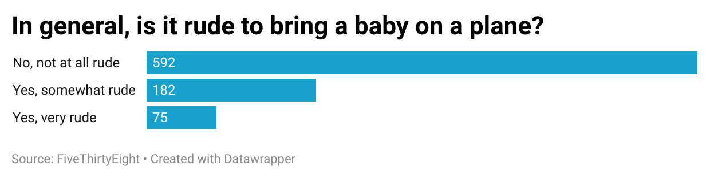

# j124-project

I initially chose to look into the question of it people thought it was rude to bring a baby on a plane. Although I understood why some people may dislike infants on planes, I wanted to see a general consensus of the population and how they actually thought of the situation. To be honest, I wasn't especially surprised by the results. 

The data showed that the majority of people believed that it was not rude to bring a baby on a plane, while around only 182 of the respondants said it was somewhat rude. Those who decided that bringing a baby on a plane was rude was by far the lowest populated data set. As I stated above, these results were, for the most part, expected, and I was glad to see that the majority of people are tolerant of newborns. 

Here is the data that is referenced to above: 

